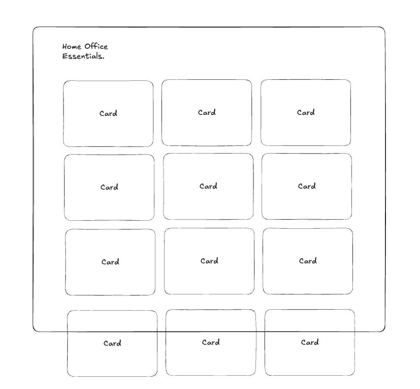
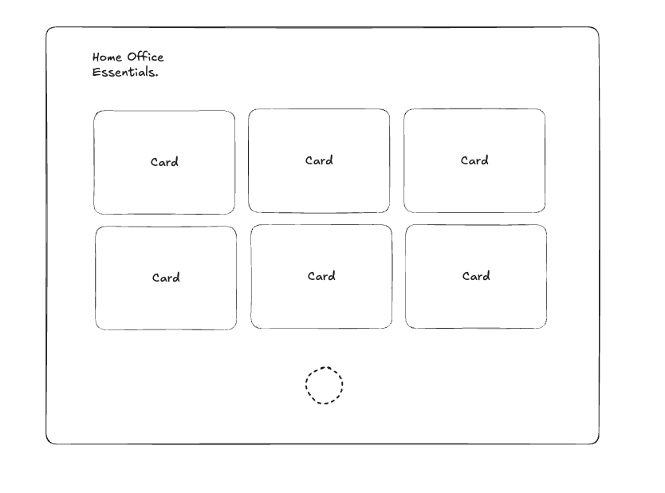

# Infinte Scroll Challenge

As the title states, this is a challenge to build an infinite scroll feature. This means that the page will have a list of items and when the user scrolls to the bottom of the list, the page will load more items automatically.

The page has the following styles:


> Important note: The colors and `Customize` button are not important for this challenge. You can ignore them. The `See more produce` section can be ignored as well, this would be a link to another page that is not included in the scope of this challenge.

Most of the styles are already applied and you should focus primarily on the infinite scroll feature. The list of cards should have 3 columns on large enough viewports and initially display 10 cards, this is how it should look:



Whenever the user scrolls to the bottom of the list, the page should load 10 more cards. You should display a loading indicator until the new cards are loaded, like this:



The cards can be fetched from `https://dummyjson.com/products`. The documentation for it can be found [here](https://dummyjson.com/docs/products), but a brief summary is:

- The endpoint will return a list of objects, each object has a lot of information but the only relevant ones are:

  ```typescript
  type Product = {
    id: string;
    title: string;
    description: string;
    price: string;
    images: string[];
  };
  ```

- The endpoint accepts `limit` and `skip` query parameters to paginate the result, i.e, `https://dummyjson.com/products?limit=10&skip=10`

# List of things expectedfrom you

## Feature-wise

- Display a list of cards that have 3 columns on large enough viewports and is responsive to the viewport size
- This list has an infinite scroll feature
- Display a loading indicator until the new cards are loaded
- Maintain a visual consistency with the provided example

## Code-wise

You should build this application as if it was part of a real project, so any code standards, patterns, etc should be applied. Things like:

- Linting
- Formatting
- Error handling
- Unit tests
- CI/CD
- Documentation
- Pull Request templates
- Git hooks
- SEO
- Performance optimizations
- Accessibility
- Code splitting
- Image optimization

Or anything else that you think is relevant. This does not mean that you should do all of these things, but you should apply the ones that make sense and are relevant to the project.
