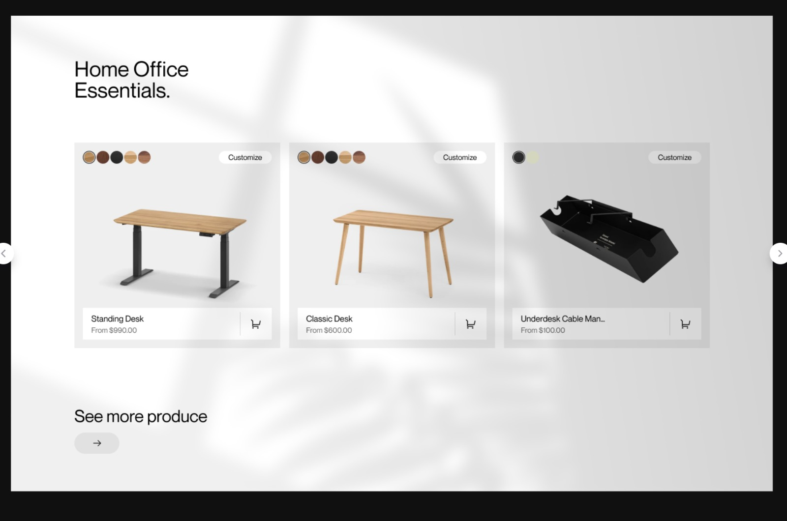

# Infinte Scroll Challenge

You need to build an infinite scroll page based on the styles below.

Your page should have this look:



You can ignore the color selection because we won't have support for it in this test.

The list of cards should have 3 columns on large enough viewports and initially display 10 cards. This list should have support for infinite scroll.

The cards can be fetched from `https://dummyjson.com/products`. The documentation for it can be found [here](https://dummyjson.com/docs/products), but a brief summary is:

- The endpoint will return a list of objects, each object has a lot of information but the only relevant ones are:

  ```typescript
  type Product = {
    id: string;
    title: string;
    description: string;
    price: string;
    images: string[];
  };
  ```

- The endpoint accepts `limit` and `skip` query parameters to paginate the result, i.e, `https://dummyjson.com/products?limit=10&skip=10`
